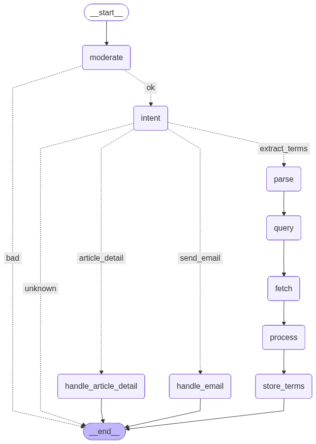

# 🤖 AI News Intelligence Agent

A sophisticated conversational AI agent that fetches, summarizes, and delivers personalized news updates with intelligent term extraction and email delivery capabilities. The app is deployed on streamlit cloud and accessable with the following link:
[Streamlit Cloud](https://v6ndvvdit9ba3p63kfuejk.streamlit.app/)

## ✨ Features

### 🎯 Core Capabilities
- **Intelligent News Fetching**: Retrieves latest news articles based on natural language queries
- **Smart Summarization**: Generates concise, readable summaries of articles
- **Technical Term Extraction**: Automatically identifies and explains technical terms
- **Conversational Follow-ups**: Maintains context across multiple interactions
- **Email Delivery**: Sends formatted news summaries directly to your inbox
- **Content Moderation**: Built-in safety checks for inappropriate content

### 🔄 Conversation Flow
1. **Content Moderation**: Validates user input for safety
2. **Intent Detection**: Understands user's goal (fetch news, article details, send email)
3. **Query Generation**: Creates optimized search queries
4. **News Retrieval**: Fetches articles from news APIs
5. **Article Processing**: Summarizes and extracts key terms
6. **Response Generation**: Formats and delivers results

## 🏗️ Architecture

### State Management
The agent uses **LangGraph** for stateful conversation management with persistent memory across interactions.

Workflow Nodes
NodePurposeNext StepmoderateContent safety checkintent or ENDintentClassify user intentRoute to appropriate handlerparseExtract parameters (topic, count, etc.)queryqueryGenerate search queryfetchfetchRetrieve news articlesprocessprocessSummarize & extract termsstore_termsstore_termsSave terms to databaseENDhandle_article_detailProvide details on specific articleENDhandle_emailSend email summaryEND
🚀 Quick Start
Prerequisites
bashCopy# Python 3.9+
python --version

# Clone the repository
git clone https://github.com/yourusername/ai-news-agent.git
cd ai-news-agent

# Create virtual environment
python -m venv venv
source venv/bin/activate  # On Windows: venv\Scripts\activate

# Install dependencies
pip install -r requirements.txt
Environment Setup
Create a .env file:
envCopy# Required
OPENAI_API_KEY=sk-...
NEWS_API_KEY=your_newsapi_key

# Optional (for email features)
SMTP_SERVER=smtp.gmail.com
SMTP_PORT=587
SMTP_EMAIL=your-email@gmail.com

SMTP_PASSWORD=your-app-password
